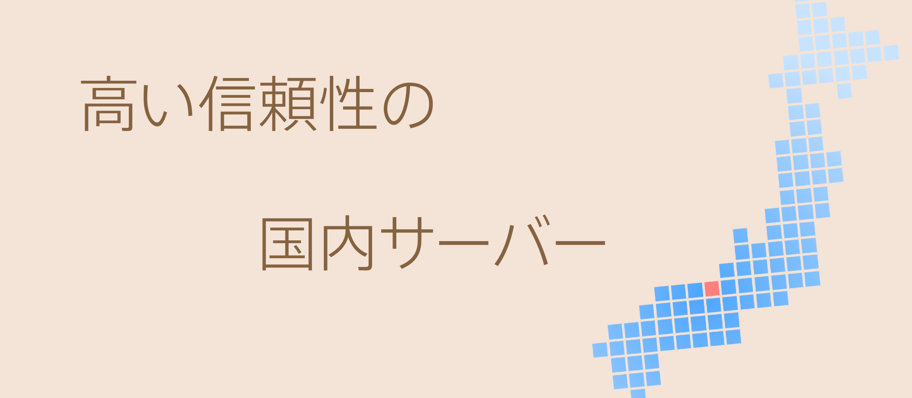

title: 
date: 2015-11-22 02:04:50
hidden_title: true
controller: index
---

  

    

      
      <!-- forked by  http://css.programming.jp/?p=933-->
      <input type="radio" id="back1" name="gal">
      <input type="radio" id="back2" name="gal">
      <input type="radio" id="back3" name="gal">
      <input type="radio" id="back4" name="gal">
      <input type="radio" id="back5" name="gal">
      <input type="radio" id="next1" name="gal">
      <input type="radio" id="next2" name="gal">
      <input type="radio" id="next3" name="gal">
      <input type="radio" id="next4" name="gal">
      <input type="radio" id="next5" name="gal">
      

        

        

        

	        <label for="back1">
＜
</label> 
	        <label for="next1">
＞
</label>
        

        

	        <label for="back2">
＜
</label>
    	    <label for="next2">
＞
</label>
        

        

	        <label for="back3">
＜
</label>
    	    <label for="next3">
＞
</label>
        

        

    	    <label for="back4">
＜
</label>
    	    <label for="next4">
＞
</label>
        

        

    	    <label for="back5">
＜
</label>
    	    <label for="next5">
＞
</label>
        

        

        

      

      

    

  

  

    

      

        
        <h2>高い信頼性</h2>
        
99.9%を超える高い稼働率で確実なサービス提供を。

      

      

        
        <h2>積み重ねられた実績</h2>
        
胡麻データでは長年の経験で得た技術で高い信頼性を提供します。

      

      

        
        <h2>幅広い分野での連携</h2>
        
データ処理分野だけでなく関連する様々な分野での技術力が単なるデータ処理だけに留まらず複合的なデータ活用を可能にします。
        

      

    

  

